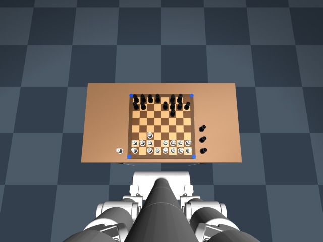

# Gambit — BracketBot plays chess

A physically embodied chess opponent for the [Bracket Bot](https://bracketbot.com): the robot
reads a real chessboard with its head camera, works out the human's move, asks **Stockfish**
for a reply, announces it, and moves the piece with its own arm — then checks the board again
before it trusts the new position.

The whole loop runs end-to-end in a MuJoCo simulation of the robot's CAD model, where you can
play against it on a clickable board. The real-robot backend is written against the Bracket
Bot SDK (`bbos`) but has not yet been run on hardware — see
[bracket_gambit/STATUS.md](bracket_gambit/STATUS.md) for exactly what is verified and what is not.

<p align="center"> </p>

```
demo video (2:55, narrated)  bracket_gambit/media/Bracket_Gambit_demo.mp4
judges' slide deck           bracket_gambit/media/Bracket_Gambit.pptx
```

---

## 1. Install (laptop: Windows / macOS / Linux)

Requirements: Python 3.10+ and [uv](https://docs.astral.sh/uv/) (`winget install astral-sh.uv`,
`brew install uv`, or `curl -LsSf https://astral.sh/uv/install.sh | sh`).

```
git clone https://github.com/GautamM303/Gambit.git
cd Gambit
uv sync                      # creates .venv with mujoco, opencv, python-chess, pillow, ...
```

### Stockfish (the chess engine)

Download the binary for your platform from
[Stockfish releases](https://github.com/official-stockfish/Stockfish/releases/tag/sf_19)
and put it in `tools/stockfish/` (any file name starting with `stockfish`), e.g.

| platform | file to put in `tools/stockfish/` |
|---|---|
| Windows | unzip `stockfish-windows-x86-64-universal.zip` → copy the `.exe` as `stockfish.exe` |
| macOS | `stockfish-macos-universal` |
| Linux x86-64 / arm64 (robot) | `stockfish-linux-x86-64-universal` / `stockfish-linux-arm64-universal` (`chmod +x`) |

It is found automatically; alternatives are `--stockfish PATH`, `$STOCKFISH`, or `stockfish` on
`PATH` (`apt install stockfish`). Without it a weak built-in engine plays and every status line
says so.

### Check the install

```
uv run pytest tests          # 31 tests, ~7 s (vision on synthetic and rendered boards, engine, manipulation, full loop)
```

## 2. Play against the robot (simulation)

```
uv run python gambit.py play --sim --opponent me --moves 0 --window
```

You are black. In the window, **click a piece, then its destination** (legal squares light up).
That moves the piece on the simulated table — the robot then reads the board with its camera
exactly as it would for a real move, thinks, announces its reply and moves its piece.

| key | action |
|---|---|
| `f` | full screen (Esc leaves it) |
| `e` | **EMERGENCY STOP** |
| `p` / `r` | pause / resume |
| `y` | "why did you play that?" |
| `w` | "what did you see?" |
| `s` | stop |

Options: `--skill 0..20` (Stockfish strength, default 5) · `--record game.mp4` (video + frames)
· `--voice` (the laptop speaks the robot's lines) · `--view` (extra MuJoCo 3-D window; CPU-heavy)
· `--http 8010` (optional web page for phones/spectators).

Let it play on its own: `uv run python gambit.py play --sim --opponent auto --opening random --moves 0 --window`

## 3. Run it on the Bracket Bot

The robot side needs the robot's `bbos` SDK (present on the robot at `/home/bracketbot/bbos`).
From this folder on Windows:

```
.\deploy_to_robot.ps1 -RobotHost bracketbot-XXX.local -InstallDeps   # copies the code, installs stockfish + espeak-ng
```

(elsewhere: `scp -r gambit.py bracket_gambit tools bracketbot@<robot>:~/bbapps/gambit/`). Then on
the robot, **in this order** — nothing moves until `--execute`:

```
ssh bracketbot@bracketbot-XXX.local
cd ~/bbapps/gambit
uv run gambit.py check --robot                        # can the arm reach every square + tray slot? (no motion)
uv run gambit.py calibrate --robot --execute          # empty-board reference photo, teach a1/h1/a8, gripper angles
uv run gambit.py play --robot                         # DRY RUN: prints every waypoint, moves nothing
uv run gambit.py play --robot --execute --moves 6     # the demo
```

Emergency stop: `e` + Enter in that terminal, Ctrl-C, or the red button of the web page
(`--http 8010`). Full bring-up checklist, board/marker/piece assumptions and the hardware
constraints (reach ≈ 24 cm → 3 cm squares; the base must be parked; prop the self-balancing
base) are in [bracket_gambit/README.md](bracket_gambit/README.md) and
[bracket_gambit/DEMO_SCRIPT.md](bracket_gambit/DEMO_SCRIPT.md).

## 4. What is where

```
gambit.py                     entry point: play / check / calibrate / init
bracket_gambit/               the package
  README.md                   full documentation: setup, calibration, operation, architecture, assumptions
  DEMO_SCRIPT.md              runbook for the demo
  STATUS.md                   what is done / simulated / hardware-unverified / omitted, next steps
  vision.py  engine.py  game.py  manipulation.py  robot.py  sim_robot.py  bbos_robot.py  ui.py
  media/                      demo video, slide deck, and the scripts that build them
tests/                        pytest suite (+ rendered board fixtures in tests/data)
chopped_urdf_v2/              the robot model (URDF + meshes) and the MuJoCo scenes
  sim/chess_robot.py          the simulated chess robot (arm, gripper pads, base, cameras)
  sim/pick_place.py           shared robot/planning library and the earlier pick-and-place demo
demos/                        Bracket Bot SDK examples (view_*.py) and the pick-by-voice demo
tools/stockfish/              put the Stockfish binary here (README inside)
deploy_to_robot.ps1           one-command copy to the robot over SSH
```

## 5. How it works (short)

1. **See** — four ArUco corner markers → homography → rectified top-down board → each square
   compared with an empty-board reference → white / black / empty (no piece recognition needed).
2. **Understand** — the occupancy change is matched against every legal move of the internal
   position; a unique zero-mismatch match is accepted, anything else is rejected with the
   offending squares named ("c6 should be empty but I see a black piece").
3. **Think** — Stockfish 19 over UCI; "why?" gets a one-line explanation grounded in the move and
   Stockfish's evaluation.
4. **Move** — pick the piece by its shaft between rubber pads (with end stops so it cannot creep
   out), carry, place until it is felt to touch; captures go to a tray first; the base turns in
   place to reach each square.
5. **Verify** — the board is re-read after every move; the internal position advances only when
   the camera agrees. A failed grasp is retried, then the robot asks for a hand.

Built on the Bracket Bot SDK, MuJoCo, OpenCV, python-chess and Stockfish.
